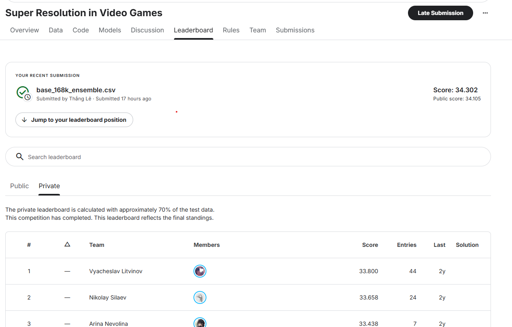

# NYCU Selected Topics in Visual Recognition using Deep Learning 2026
# Final project on Super Resolution in Video Games


- Team member: Quang-Thang Le, Dinh-Hung Le, Kevin Wijaya

## Introduction
This repository contains the full training and inference pipeline for HAT.

This repository is based on https://github.com/XPixelGroup/HAT.git. If you have any issue with this repo, you can also find solutions in the original one.

## Enviroment setup

- Follow instructions in https://github.com/XPixelGroup/HAT.git to set up the enviroment

## Infer

1. Download checkpoint at https://drive.google.com/file/d/17fxnMkvawV0nnEW9ivusjvHpp9kRcvYo/view?usp=drive_link 
And put it at experiments/final/models/net_g_latest.pth

2. Run 
```
EXPERIMENT=final

# infer
CUDA_VISIBLE_DEVICES=0 PYTHONPATH=./ python hat/test.py -opt options/test/HAT_SRx4_ImageNet-LR_infer_base.yml

# gen csv
python gen_submission.py \
--folder ./results/${EXPERIMENT}/images \
--save-path ./results/${EXPERIMENT}/${EXPERIMENT}.csv \
--public-size 1

# submit to kaggle
kaggle competitions submit -c super-resolution-in-video-games -f ./results/${EXPERIMENT}/${EXPERIMENT}.csv  -m "${EXPERIMENT}"
```
to infer, gen csv file, and submit this file to kaggle

3. The final results are saved at `results/final`.

## Usage

1. Download the dataset, extract it, and place it in the `dataset` folder. Download pretrained models at https://drive.google.com/file/d/1YIpTzmA63dXy6ZRDt-Y3nUetvsLVYwwK/view?usp=sharing, extract it, and place it in the `pretrained_models` folder.
2. Run 
```
python process_data.py
```
to split data to train and val sets
3. Run 
```
CUDA_VISIBLE_DEVICES=0,1,2,3 \
python -m torch.distributed.launch \
--use-env --nproc_per_node=4 --master_port=1145 \
basicsr/train.py \
-opt options/train/final.yml \
--launcher pytorch
```
to train the model

4. Run 
```
EXPERIMENT=final

# infer
CUDA_VISIBLE_DEVICES=0 \
python inference_all_images_TTA_2.py \
--in_path  ./dataset/test/lr \
--out_path  ./results/${EXPERIMENT}/images \
--scale 4 \
--task classical \
--checkpoint experiments/${EXPERIMENT}/models/net_g_latest.pth

# gen csv
python gen_submission.py \
--folder ./results/${EXPERIMENT}/images \
--save-path ./results/${EXPERIMENT}/${EXPERIMENT}.csv \
--public-size 1

# submit to kaggle
kaggle competitions submit -c super-resolution-in-video-games -f ./results/${EXPERIMENT}/${EXPERIMENT}.csv  -m "${EXPERIMENT}"
```
to infer, gen csv file, and submit this file to kaggle

5. The final results are saved at `results/final`.


## Performance Snapshot

